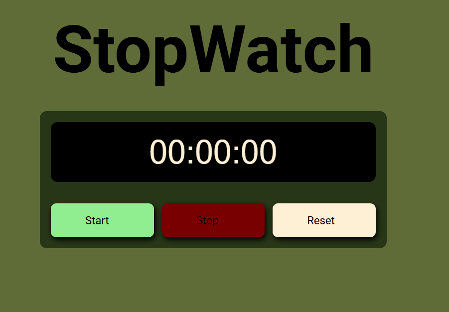

<<<<<<< HEAD
# ⏱️ Cronômetro Interativo


## 📋 Sobre o Projeto

Um cronômetro digital interativo desenvolvido com HTML, CSS e JavaScript puro. O projeto demonstra conceitos de:

- **Programação Orientada a Objetos (POO)** com classes JavaScript
- **Manipulação do DOM** para atualizações em tempo real
- **CSS moderno** com animações e efeitos visuais
- **Event Listeners** para interações do usuário

### 🎯 Funcionalidades

- ✅ Iniciar/Parar/Resetar cronômetro
- ✅ Formatação automática de tempo (HH:MM:SS)
- ✅ Feedback visual com animações
- ✅ Design responsivo
- ✅ Interface intuitiva e amigável

---

## 🚀 Tecnologias Utilizadas

| Tecnologia | Descrição |
|------------|-----------|
| **HTML5** | Estrutura da aplicação |
| **CSS3** | Estilização e animações |
| **JavaScript ES6+** | Lógica do cronômetro (classes, arrow functions, template literals) |

---

## 📸 Demonstração

### Interface Principal


### Em Ação


---

## 🛠️ Como Executar o Projeto

### Pré-requisitos
- Navegador moderno (Chrome, Firefox, Edge)
- Editor de código (VS Code, Sublime, etc.)

### Passos

1. **Clone o repositório**
```bash
git clone https://github.com/AyrtonKarlosMarquesDeSena/STOPWATCH
=======
# STOPWATCH
Cronômetro Interativo com JavaScript
>>>>>>> 69187a56871bd3655aadb062c7abfe4d54c259d4
